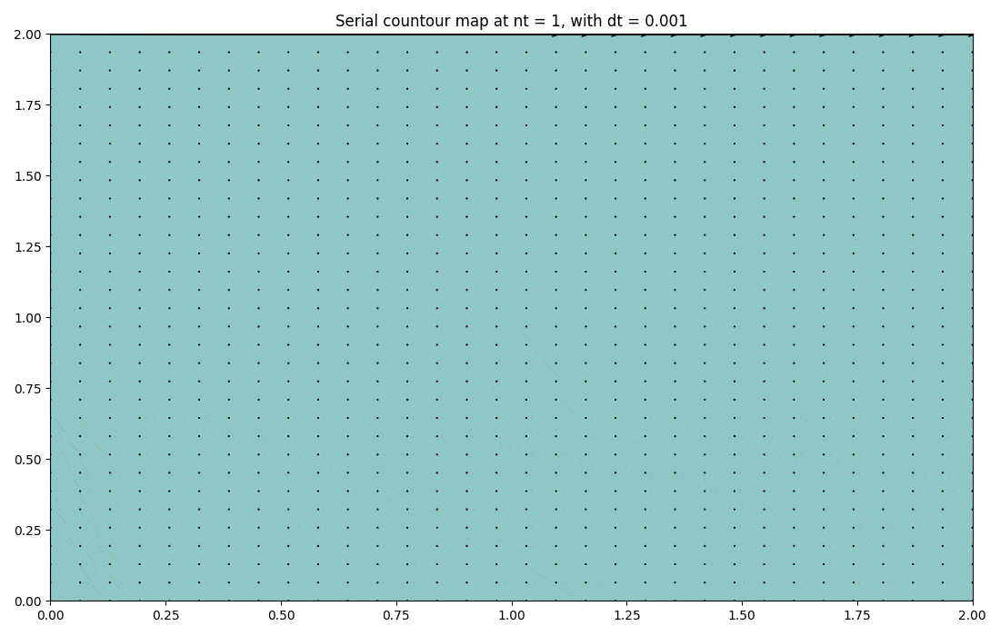
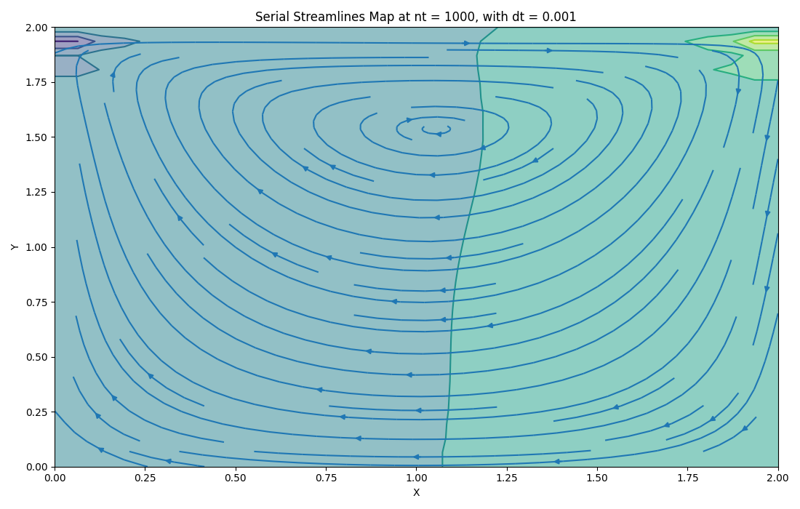

# Hydrodynamic Flow Cuda
We implemented Hydrodynamic Flow by serial code and CUDA parallel code by C Programming using Navier-Stokes Equations.
## Some Results

### Results Visualisation


<span class="img_container center" style="display: block;">
    
    <span class="img_caption" style="display: block; text-align: center;">Hydrodynamic Flow with Cavity Flow Initial and Boundary Conditions</span>
</span>

### Serial and Cuda Implentation Results 


<p align="center">
  
&nbsp; 
  
</p>

We could see that there is no difference between two versions by this visualisation.


Note that all the visualisation above using the **same settings** with:

- nx = ny = 32
- xmax = ymax = 2.0
- dt = 0.001
- nit = 50
- c = 1.0
- rho = 1.0
- nu = 0.1
- Cavity Flow initial and boundary condition 

## Google Colab Version

```
https://colab.research.google.com/drive/1ilI0XfSarNcL8cmxldoTFIiAHviu_4Y0?usp=sharing
```

## Team Members


| Member ID | Full Name       | Student ID    |  Github|
| :--:|    :---:              |   :---:       | :---:|
| 1   | Nguyen Quang Duc      | 20204876      |https://github.com/qducnguyen|
| 2   | Le Hong Duc           | 20204874      |https://github.com/duclh19 |
| 3   | Tran Le Phuong Thao   | 20200604      |https://github.com/TranafLee |
| 4   | La Dai Lam            | 20204918      |https://github.com/ladailam382 |
| 5   | Luu Trong Nghia       | 20204888      |https://github.com/nghialt0205 |

*For any information, please contact me at ducnq.204876@sis.hust.edu.vn*
